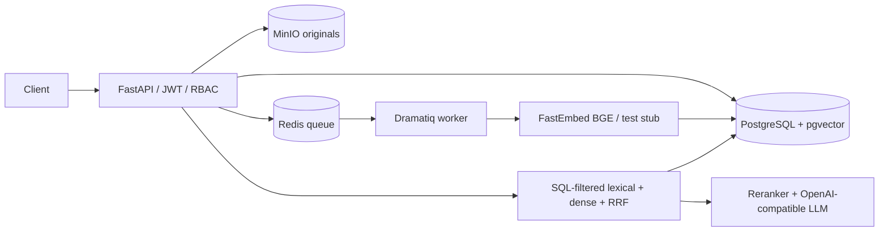

# Enterprise RAG

[](https://github.com/BetterThanAny/enterprise-rag/actions/workflows/ci.yml)
[](.mise.toml)
[](LICENSE)

A backend-first, multi-tenant RAG knowledge base focused on the hard parts that portfolio demos
often skip: SQL-level tenant/ACL filtering, idempotent indexing, worker-kill recovery, authorized
citations, versioned traces, and reproducible retrieval evidence.



The repository has released M1 through M5. The M6 implementation is present as a release candidate
and remains pending the final GitHub delivery checks recorded in `PLAN.md`. See
[architecture](docs/architecture.md), [reproducible demos](docs/demo.md), and the command-by-command
acceptance record in `PLAN.md`.

## Evidence, not headline percentages

| Evaluation | Dataset | Recall@5 | MRR@10 | NDCG@10 | Interpretation |
|---|---:|---:|---:|---:|---|
| FastEmbed `BAAI/bge-small-en-v1.5` | SciFact: 5,183 docs / 188 human-labeled queries | 0.864805 | 0.784729 | 0.819212 | Public semantic evidence; scientific domain only |
| Deterministic hash baseline (384d) | Same SciFact subset | 0.000000 | 0.000000 | 0.000000 | Negative control, not a semantic model |
| Lexical regression | 200 controlled synthetic queries | 1.000000 | see report | see report | Repeatable correctness gate, not production quality |

The SciFact run used a pinned archive checksum and recorded 445.484 seconds for full-corpus CPU
embedding; the reproducible report lives at
`data/eval/reports/m6-scifact-bge-small-en-v1.5.json`. Dataset provenance and licenses are in
`data/eval/README.md`.

## Current capabilities

- FastAPI liveness, dependency-aware readiness, and version endpoints
- PostgreSQL schema and Alembic migration for tenants, global user identities, memberships,
  knowledge bases, documents, document ACLs, and index-job state
- JWT login plus tenant-scoped `owner`, `admin`, `member`, and `viewer` authorization
- Tenant-filtered knowledge-base create/list/get endpoints
- JSON logs, caller-supplied or generated request IDs, and stable JSON errors
- Docker Compose services for PostgreSQL/pgvector, Redis, MinIO, bucket initialization, and API
- PDF, UTF-8 TXT, and Markdown uploads with immutable MinIO object keys and document versions
- Dramatiq/Redis asynchronous indexing with PostgreSQL-backed job state, leases, bounded retry, and
  explicit `pending`, `running`, `succeeded`, `failed`, and `cancelled` states
- Deterministic parsing, text cleanup, overlapping chunks, embedding-provider abstraction, and
  `pgvector` persistence
- A real CPU FastEmbed `BAAI/bge-small-en-v1.5` provider with a separate 384-dimensional semantic
  vector column and non-destructive migration from the original 16-dimensional test vectors
- Idempotent upload/update/rebuild operations, document deletion, and orphan-object cleanup
- Worker-kill recovery at parse, embedding, and database-write stages without duplicate chunks
- Tenant-scoped document and job APIs with filename and upload-size validation
- Switchable PostgreSQL full-text, pgvector dense, and RRF hybrid retrieval with tenant,
  knowledge-base, current-version, and ACL filtering inside each ranking query
- Optional FlashRank Cross-Encoder reranking and tenant-owned retrieval traces containing candidate
  scores, latency, and configuration/dataset versions
- A fixed 200-query controlled retrieval regression set and reproducible lexical/dense/hybrid/
  hybrid+rerank ablation report
- A fixed-checksum SciFact dev evaluation over the full 5,183-document corpus and 188 queries with
  human evidence annotations
- OpenAI-compatible streaming provider boundary with OpenAI and DeepSeek remote configurations,
  an Ollama local configuration, and an explicitly marked deterministic development/test stub
- SSE answers with timeout/disconnect cancellation, authorized chunk-ID validation, citation
  excerpts plus PDF page/Markdown heading provenance, and explicit no-evidence abstention
- Tenant-owned generation traces containing rendered prompts, terminal status, validated citations,
  and prompt/model/provider/retrieval/rerank/dataset versions
- A fixed 20-answer/20-abstention controlled grounding regression set and reproducible M4 report
- Prometheus request/error, retrieval, TTFT, generation, token, cost, and recovery metrics plus
  optional OTLP/HTTP OpenTelemetry export
- Tenant-scoped trace reconstruction linking retrieval candidates/scores, rerank, provider call,
  terminal generation state, usage, cost, citations, request ID, and versioned configuration
- Bounded pre-output Provider 429/5xx recovery and PostgreSQL-authoritative Redis outage recovery
- An authenticated HTTP/JSON target compatible with `llm-eval-platform`'s generic HTTP adapter
- A deterministic 50,000-chunk/20-concurrency hybrid+rerank load gate and isolated fresh-stack demo
- A real semantic fresh-stack demo and optional Docker Ollama live-token smoke

Defaults remain deterministic so CI is credential-free and never downloads a model silently. Set
`EMBEDDING_PROVIDER=fastembed` for real semantic retrieval; `scripts/demo.py --semantic` verifies
that model through worker indexing and PostgreSQL/pgvector retrieval. Generation defaults to an
explicit test stub, while the optional Compose Ollama profile has been live-tested with streamed
tokens. Provider usage is exact when returned and marked `estimated` otherwise.

This is not a hosted SaaS or a production benchmark. There is no frontend, conversation/message
persistence, OCR/layout model, provider-management UI, external OTLP deployment, or online demo.
SciFact is scientific-domain evidence retrieval and must not be presented as enterprise-policy
traffic. These limits are intentional and documented rather than implied as delivered features.

## Environment

Python 3.12.13 is pinned by `mise`. Copy the variable names from `.env.example`, replace every
placeholder, and load the values through the shell or 1Password:

```bash
op run --env-file=.env -- docker compose up -d --build
```

The `DATABASE_URL` used by the API container must address the Compose host `postgres:5432`. A host
test command should instead use the published port (default `localhost:15432`). No default database,
object-storage, or JWT secret is committed.

## Commands

```bash
mise exec -- uv sync
mise exec -- uv run ruff check .
mise exec -- uv run pyright
mise exec -- uv run pytest -q tests/unit
mise exec -- uv run alembic upgrade head
mise exec -- uv run pytest -q tests/integration
mise exec -- uv run pytest -q tests/security
mise exec -- uv run pytest -q tests/fault
mise exec -- uv run python scripts/smoke_test.py
mise exec -- uv run python scripts/evaluate_retrieval.py --dataset data/eval/retrieval.jsonl
mise exec -- uv run python scripts/evaluate_generation.py --dataset data/eval/generation.jsonl
mise exec -- uv run python scripts/evaluate_public_retrieval.py
mise exec -- uv run python scripts/cleanup_orphans.py --dry-run
mise exec -- uv run python scripts/recovery_test.py
mise exec -- uv run python scripts/load_test.py --chunks 50000 --concurrency 20
```

## Fresh-machine demo

With only Git, Docker, and mise available, the following installs the pinned project environment,
starts an isolated stack with process-local ephemeral secrets, migrates an empty database, and runs
readiness, login, upload, worker indexing, hybrid/rerank retrieval, SSE answer/citation, and delete:

```bash
mise install
mise exec -- uv sync --frozen
mise exec -- uv run python scripts/demo.py
```

To exercise the real semantic model through a fresh PostgreSQL/pgvector stack:

```bash
mise exec -- uv run python scripts/demo.py --semantic
```

The demo prints its Compose project name and intentionally leaves its containers and isolated
volumes intact for inspection. Persistent deployments should instead use `.env.example` variable
names and `op run --env-file=.env -- docker compose up -d --build --wait`.

Integration and security tests require `TEST_DATABASE_URL`, `TEST_REDIS_URL`,
`TEST_MINIO_ENDPOINT`, `TEST_MINIO_ACCESS_KEY`, `TEST_MINIO_SECRET_KEY`, and `TEST_MINIO_BUCKET`.
They fail clearly when a dependency is absent; they are not silently skipped.

## API

- `GET /health/live`
- `GET /health/ready`
- `GET /version`
- `POST /api/v1/auth/login`
- `POST /api/v1/knowledge-bases` (`owner` or `admin`)
- `GET /api/v1/knowledge-bases`
- `GET /api/v1/knowledge-bases/{id}`
- `POST /api/v1/knowledge-bases/{id}/documents` (`owner` or `admin`, multipart upload)
- `PUT /api/v1/documents/{id}` (`owner` or `admin`, multipart update)
- `POST /api/v1/documents/{id}/rebuild` (`owner` or `admin`)
- `DELETE /api/v1/documents/{id}` (`owner` or `admin`)
- `GET /api/v1/index-jobs/{id}`
- `POST /api/v1/index-jobs/{id}/cancel` (`owner` or `admin`)
- `POST /api/v1/knowledge-bases/{id}/retrieve`
- `POST /api/v1/knowledge-bases/{id}/answers/stream` (SSE)
- `POST /api/v1/knowledge-bases/{id}/evaluations` (HTTP/JSON evaluation target)
- `GET /api/v1/traces/{generation_trace_id}`
- `GET /metrics`

Tenant-scoped calls require both a bearer token and `X-Tenant-ID`. Cross-tenant resource lookup is
filtered in SQL and returns 404 to avoid disclosing resource existence.

The generation endpoint accepts only registered provider names. `openai` and `deepseek` require
runtime API keys; `ollama` targets the configured local OpenAI-compatible endpoint. The server emits
`meta`, `token`, validated `citation`, terminal `done`, and failure `error` SSE events. Retrieved
document text is treated as untrusted prompt data, and the server never emits a citation for a chunk
outside the authorized retrieval result.

For the independent evaluation platform, configure an HTTP target whose URL ends in
`/api/v1/knowledge-bases/{id}/evaluations`, `input_field` is `input`, and `response_path` is
`output`. Put `X-Tenant-ID` in non-secret headers and reference an environment variable containing
the full `Bearer ...` value through `header_env.Authorization`. The raw response also contains
usage and trace metadata; the two projects do not share a database or source dependency.

Operational procedures are in `docs/operations.md`; failure diagnosis is in
`docs/troubleshooting.md`. Architecture tradeoffs are recorded under `docs/adr/`.

Upload, update, and rebuild requests also require an `Idempotency-Key` header. Accepted work returns
`202 Accepted` with a stable `task_id`, `document_id`, and `version_id`. The worker command in
Compose scans pending or expired jobs on startup before consuming the Dramatiq queue.
