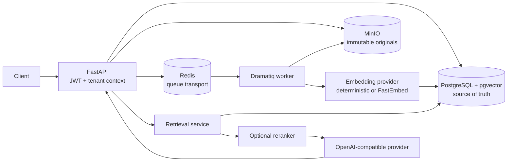
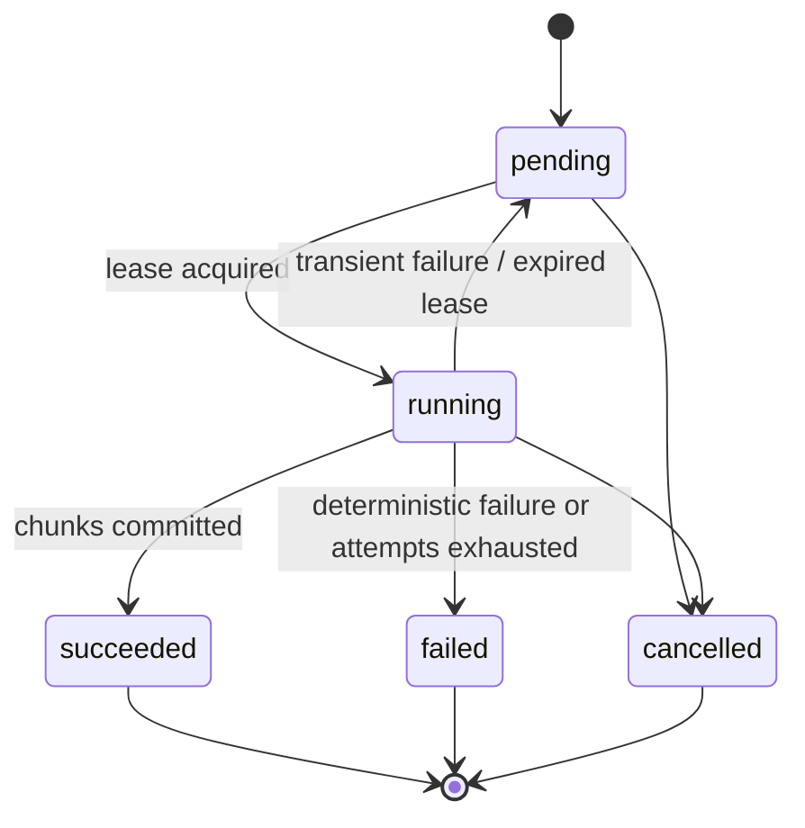

# Local backend portfolio architecture and trust boundaries

## Request and data boundaries

1. The API derives a tenant context from the JWT membership and `X-Tenant-ID`; callers cannot
   supply an arbitrary effective tenant.
2. Repository queries include tenant, knowledge-base, current-version, and ACL predicates before
   lexical or vector ranking. Unauthorized chunks never enter the candidate set. This is an
   application-query invariant, not PostgreSQL row-level security.
3. PostgreSQL owns document/version/job state. Redis is transport, so a lost queue message can be
   reconstructed from pending or expired database jobs.
4. MinIO keys are immutable identifiers containing tenant scope. The database never stores a local
   absolute path.
5. A chunk row contains exactly one vector kind: the explicit deterministic development vector or
   the 384-dimensional semantic vector. Retrieval selects the column matching the configured
   provider.
6. The generation layer only accepts citations that map back to the authorized retrieval result.
   Empty or weak evidence takes the explicit abstention path.

## Indexing state machine

Database uniqueness constraints and a single transaction for chunk replacement make retry
idempotency enforceable rather than advisory. Worker-kill tests cover parse, embedding, and
database-write boundaries.

## Deliberately unimplemented

- No Vue or other browser UI; this repository is a backend/API portfolio project.
- No conversation/message persistence or provider-management UI.
- No database row-level security, OCR/layout model, Kubernetes, multi-region failover, or hosted
  production deployment.
- No claim that SciFact represents private enterprise-policy traffic.

See the ADRs for milestone-specific decisions and `PLAN.md` for exercised exit conditions.
